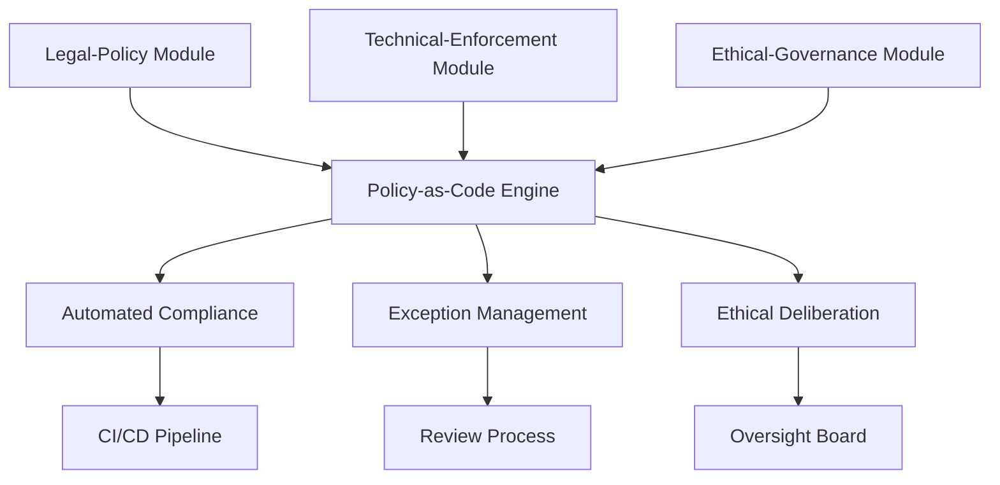

# Dynamic Digital Privacy Framework (DDP)
*An Adaptive Governance Model for Emerging Technological Threats*

[](https://ieee-isope.org/)
[](#)
[](#license)

## Overview

The Dynamic Digital Privacy (DDP) Framework is a revolutionary approach to privacy governance designed to address the shortcomings of static regulatory models in an era of rapid and unpredictable technological change. Developed for the IEEE Symposium on Privacy Expectations (ISOPE) 2025, this framework leverages DevSecOps principles—automation, continuous integration, and collaborative feedback loops—to embed privacy controls directly into the technology development lifecycle.

> **"Privacy is not a state to be achieved but a system in perpetual motion, designed to evolve in response to a continuous stream of inputs."**

## 🚀 Live Demo

Experience the DDP Framework in action:
- **[Interactive Demo](https://ppl-ai-code-interpreter-files.s3.amazonaws.com/web/direct-files/d91925de6626ba5465c477b7c30c8589/789ad557-3f81-4da7-94de-2ccc89c0585d/index.html)** - Full interactive mockup showcasing all three modules
- **Conference Presentation** - IEEE ISOPE 2025, New York City

## 📖 Table of Contents

- [Problem Statement](#problem-statement)
- [Framework Architecture](#framework-architecture)
- [Core Principles](#core-principles)
- [Implementation Guide](#implementation-guide)
- [Demo Application](#demo-application)
- [Key Features](#key-features)
- [Metrics & KPIs](#metrics--kpis)
- [Future Threats](#future-threats)
- [Getting Started](#getting-started)
- [Documentation](#documentation)
- [Contributing](#contributing)
- [Academic Citation](#academic-citation)

## 🎯 Problem Statement

Traditional privacy laws like GDPR and CCPA/CPRA rely on **static frameworks** built for past technologies. This creates a "pacing problem" where:

- **Lawmaking lags behind** fast-evolving privacy threats
- **Emerging threats** like browser fingerprinting, insecure IoT data, inference attacks on federated learning, quantum risks, and Brain-Computer Interfaces are not adequately covered
- **Static regulations fail** to address novel data types, ambiguous consent, and future-horizon risks

### Dynamic Threats Outpacing Static Regulations

| Threat Type | Timeline | Regulatory Coverage | DDP Solution |
|-------------|----------|-------------------|--------------|
| Browser Fingerprinting | Current | Limited | Automated detection & blocking |
| IoT Data Collection | Current | Fragmented | Pervasive encryption enforcement |
| Inference Attacks | Current | None | Proactive threat modeling |
| Quantum Computing | 2030-2035 | None | Crypto-agility implementation |
| Brain-Computer Interfaces | 2026-2030 | None | Ethical framework development |

## 🏗️ Framework Architecture

The DDP Framework consists of three modular, interoperable components:

### 1. Legal-Policy Module
- **Function**: Translates regulations (GDPR, CCPA/CPRA) into machine-readable Policy-as-Code
- **Technology**: Rego language with Open Policy Agent (OPA)
- **Output**: Versioned, auditable policy libraries
- **Team**: Legal, compliance, and privacy professionals

### 2. Technical-Enforcement Module
- **Function**: Embeds policies into DevSecOps CI/CD pipelines
- **Technology**: Infrastructure-as-Code, automated security testing
- **Output**: Continuous compliance verification
- **Team**: Engineering, security, and operations

### 3. Ethical-Governance Module
- **Function**: Human-in-the-loop oversight and strategic direction
- **Technology**: Three-tier decision framework
- **Output**: Ethical rulings and policy evolution
- **Team**: Cross-functional privacy team + independent oversight board



## 🎯 Core Principles

### 1. Continuous Adaptation
Privacy policies evolve constantly through feedback loops and threat intelligence, moving beyond static, one-shot rule-making.

### 2. Automated Validation
Privacy controls are codified and integrated directly into the development lifecycle, with automatic verification at every stage.

### 3. Proactive Threat Modeling
Anticipates and mitigates emerging and future privacy risks early in development, embracing the "shift left" philosophy.

### 4. Ethical Perspective
Fairness, transparency, and user autonomy are embedded as first-class requirements alongside technical and legal mandates.

## 📋 Implementation Guide

### Prerequisites
- DevSecOps infrastructure with CI/CD pipelines
- Open Policy Agent (OPA) deployment
- Infrastructure-as-Code tools (Terraform, Ansible)
- Cross-functional team with legal, technical and ethical expertise

### Quick Start

1. **Set up the Legal-Policy Module**
   ```bash
   # Install OPA
   curl -L -o opa https://openpolicyagent.org/downloads/v0.58.0/opa_linux_amd64_static
   chmod 755 ./opa

   # Initialize policy repository
   git init ddp-policies
   cd ddp-policies
   mkdir -p policies/gdpr policies/ccpa
   ```

2. **Configure Policy-as-Code**
   ```rego
   # policies/gdpr/article25.rego
   package gdpr.art25

   deny {
     resource := input.resource_changes[_]
     resource.type == "aws_s3_bucket"
     resource.change.after.server_side_encryption_configuration == null
   }
   ```

3. **Integrate with CI/CD**
   ```yaml
   # .github/workflows/privacy-compliance.yml
   name: Privacy Compliance Check
   on: [push, pull_request]
   jobs:
     privacy-check:
       runs-on: ubuntu-latest
       steps:
         - uses: actions/checkout@v3
         - name: Run OPA Tests
           run: opa test policies/
   ```

4. **Set up Governance Tiers**
   ```yaml
   # governance-config.yml
   tiers:
     tier1:
       type: "automated"
       threshold: "low-medium_risk"
     tier2:
       type: "managed_exception"
       reviewers: ["legal-team", "security-team"]
     tier3:
       type: "ethical_deliberation"
       board: "ethical-oversight-board"
   ```

## 🎮 Demo Application

The interactive demo showcases all three modules of the DDP Framework:

### Key Features
- **Real-time Metrics Dashboard** - MTTR, Policy Violation Rate, Exception Requests
- **Policy Editor** - Interactive Rego code editor with syntax highlighting
- **CI/CD Pipeline Visualization** - Live security scanning and compliance checks
- **Governance Workflow** - Three-tier decision making process
- **Threat Modeling** - Future-proofing against quantum computing and BCIs
- **Simulation Mode** - Demonstrates framework responses to various scenarios

### Screenshots (work in progress)

*Dashboard Overview*


*Policy-as-Code Editor*


*Governance Workflow*


## 🔧 Key Features

### Automated Compliance
- **GDPR Article 25** - Data Protection by Design & Default
- **GDPR Article 17** - Right to Erasure automation
- **CCPA/CPRA** - Consumer opt-out rights enforcement
- **Infrastructure-as-Code** - Privacy controls embedded in infrastructure

### Continuous Monitoring
- Real-time policy violation detection
- Automated remediation workflows
- Comprehensive audit trails
- Risk-based alerting

### Agile Governance
- Three-tier decision framework
- Exception handling workflows
- Independent ethical oversight
- Cross-functional collaboration

## 📊 Metrics & KPIs

The DDP Framework introduces leading indicators for privacy risk management:

| Metric | Definition | Target | Current |
|--------|------------|---------|---------|
| **MTTR** | Mean Time to Remediate privacy flaws | < 10 min | 8 min |
| **Policy Violation Rate** | % of builds blocked by privacy checks | < 15% | 12% |
| **Exception Request Rate** | Frequency of Tier 2 exception requests | < 1% | 0.3% |
| **Ethical Review Cycle Time** | Time for Tier 3 board decisions | < 7 days | 4.2 days |
| **Audit Readiness Time** | Time to generate compliance evidence | < 2 hours | < 1 hour |

### Sample Dashboard Metrics
```json
{
  "metrics": {
    "mttr": "8 minutes",
    "policyViolationRate": "12%",
    "exceptionRequestRate": "0.3%",
    "ethicalReviewCycleTime": "4.2 days",
    "auditReadinessTime": "< 1 hour"
  },
  "compliance": {
    "gdpr": { "coverage": "94%", "violations": 3 },
    "ccpa": { "coverage": "91%", "violations": 1 },
    "cpra": { "coverage": "89%", "violations": 2 }
  }
}
```

## 🔮 Future Threats

The DDP Framework is designed to address emerging privacy challenges:

### Quantum Computing Threats
- **Store Now, Decrypt Later (SNDL)** attacks
- **Crypto-agility** implementation
- **Post-quantum cryptography** transition

### Brain-Computer Interfaces (BCIs)
- **Neural data** protection
- **Cognitive liberty** preservation
- **Mental privacy** safeguards

### Advanced IoT & Edge Computing
- **Pervasive data collection** management
- **Edge privacy** enforcement
- **Federated learning** security

## 🚀 Getting Started (work in progress)

### For Developers
1. Clone the repository
2. Follow the [Implementation Guide](#implementation-guide)
3. Set up your first Policy-as-Code rules
4. Integrate with existing CI/CD pipelines

### For Legal Teams
1. Review the [Legal Framework Mapping](docs/legal-framework-mapping.md)
2. Understand Policy-as-Code translation process
3. Collaborate with technical teams on policy implementation

### For Governance Teams
1. Study the [Three-Tier Governance Model](docs/governance-model.md)
2. Establish ethical oversight board
3. Define escalation procedures

## 📚 Documentation (work in progress)

### Core Documentation
- [Architecture Deep Dive](docs/architecture.md)
- [Policy-as-Code Guide](docs/policy-as-code.md)
- [DevSecOps Integration](docs/devsecops-integration.md)
- [Governance Framework](docs/governance-framework.md)
- [Metrics & Monitoring](docs/metrics.md)

### Implementation Guides
- [GDPR Compliance Automation](docs/gdpr-automation.md)
- [CCPA/CPRA Implementation](docs/ccpa-implementation.md)
- [Threat Modeling Procedures](docs/threat-modeling.md)
- [Ethical Decision Making](docs/ethical-framework.md)

### API Documentation
- [REST API Reference](docs/api-reference.md)
- [Policy Engine SDK](docs/sdk.md)
- [Integration Examples](docs/examples.md)

## 🤝 Contributing (work in progress)

We welcome contributions from the privacy, legal, and technology communities!

### How to Contribute
1. **Fork** the repository
2. **Create** a feature branch (`git checkout -b feature/amazing-feature`)
3. **Commit** your changes (`git commit -m 'Add amazing feature'`)
4. **Push** to the branch (`git push origin feature/amazing-feature`)
5. **Open** a Pull Request

### Contribution Areas
- **Policy Templates** - New regulation mappings
- **Integration Tools** - CI/CD pipeline integrations
- **Threat Models** - Emerging privacy threats
- **Documentation** - Implementation guides and examples

### Code of Conduct
This project follows the [IEEE Code of Ethics](https://www.ieee.org/about/corporate/governance/p7-8.html).

## 📄 Academic Citation

If you use this framework in your research or implementation, please cite:

```bibtex
@conference{degni2025ddp,
  author = {Fabrizio Degni},
  title = {Dynamic Digital Privacy: An Adaptive Governance Model for Emerging Technological Threats},
  booktitle = {IEEE Symposium on Privacy Expectations (ISOPE)},
  year = {2025},
  address = {New York, NY, USA},
  organization = {IEEE},
  url = {https://ieee-isope.org/}
}
```

## 📖 Related Publications (work in progress)

- **Primary Paper**: [Dynamic Digital Privacy: A DevSecOps Framework for an Evolving Threat Landscape](docs/paper.pdf)
- **Conference Presentation**: [Bridging the Privacy Gap: Introducing the Dynamic Digital Privacy Framework](docs/presentation.pdf)
- **Technical Report**: [Operationalizing DDP with DevSecOps](docs/technical-report.pdf)

## 🛡️ Security & Privacy

This project implements privacy by design principles:
- **No personal data collection** in demo application
- **Open source transparency** for all components
- **Security-first development** practices
- **Regular security audits** and updates

## 🏆 Recognition

- **IEEE ISOPE 2025** - Featured presentation


## 📞 Contact & Support

### Primary Author
**Fabrizio Degni**  
Chief of Artificial Intelligence  
Email: io@fabriziodegni.com  
LinkedIn: [https://www.linkedin.com/in/fdegni/](https://www.linkedin.com/in/fdegni/)

### Conference Information
**IEEE Symposium on Privacy Expectations (ISOPE)**  
October 2025 | New York City, NY  
Website: [https://ieee-isope.org/](https://ieee-isope.org/)

### Issues & Questions
- **GitHub Issues**: For technical problems and feature requests
- **Discussions**: For general questions and community discussion
- **Email**: For private inquiries and collaboration opportunities

## 📋 License

This project is licensed under the MIT License - see the [LICENSE](LICENSE) file for details.

---

## 📈 Project Statistics


---

*© 2025 Fabrizio Degni. The Dynamic Digital Privacy Framework represents a paradigm shift toward adaptive, ethical and automated privacy governance in the age of rapid technological evolution.*

**Built for IEEE ISOPE 2025 | New York City | [ieee-isope.org](https://ieee-isope.org/)**
