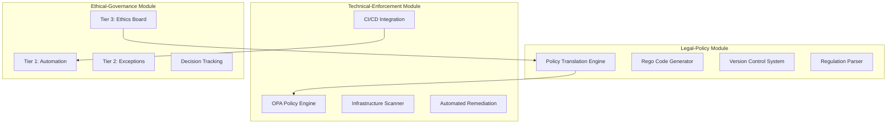

# DDP Framework Architecture

## Overview

The Dynamic Digital Privacy (DDP) Framework employs a modular architecture that enables scalable, adaptive privacy governance. This document provides detailed technical specifications for each component.

## System Architecture



## Component Specifications

### Legal-Policy Module

#### Policy Translation Engine
- **Input**: Legal text (GDPR, CCPA, CPRA)
- **Output**: Machine-readable policy definitions
- **Language**: Rego for Open Policy Agent
- **Storage**: Git-based version control

```rego
package gdpr.art25

# Data Protection by Design and Default
deny {
    resource := input.resource_changes[_]
    resource.type == "aws_s3_bucket"
    not resource.change.after.server_side_encryption_configuration
}

deny {
    resource := input.resource_changes[_]
    resource.type == "aws_rds_instance" 
    not resource.change.after.encrypted
}
```

#### Version Control Integration
- **Repository Structure**:
  ```
  ddp-policies/
  ├── policies/
  │   ├── gdpr/
  │   │   ├── article17.rego
  │   │   ├── article25.rego
  │   │   └── article32.rego
  │   ├── ccpa/
  │   │   ├── opt-out.rego
  │   │   └── deletion.rego
  │   └── custom/
  │       └── organization-specific.rego
  ├── tests/
  └── schemas/
  ```

### Technical-Enforcement Module

#### CI/CD Pipeline Integration
```yaml
# Example GitHub Actions Workflow
name: DDP Privacy Compliance

on: [push, pull_request]

jobs:
  privacy-check:
    runs-on: ubuntu-latest
    steps:
      - uses: actions/checkout@v3

      - name: Setup OPA
        run: |
          curl -L -o opa https://openpolicyagent.org/downloads/v0.58.0/opa_linux_amd64_static
          chmod 755 ./opa

      - name: Validate Infrastructure
        run: |
          terraform plan -out=plan.tfplan
          terraform show -json plan.tfplan | ./opa eval -d policies/ -I data.terraform.analysis.deny

      - name: Security Scanning
        run: |
          # SAST
          semgrep --config=auto .

          # SCA
          safety check

          # Container scanning
          trivy image ${{ env.IMAGE_NAME }}
```

#### Automated Security Testing
- **SAST (Static Application Security Testing)**
  - Tools: Semgrep, SonarQube, Checkmarx
  - Integration: Pre-commit hooks + CI pipeline

- **DAST (Dynamic Application Security Testing)**
  - Tools: OWASP ZAP, Burp Suite
  - Integration: Staging environment testing

- **SCA (Software Composition Analysis)**
  - Tools: Snyk, Safety, FOSSA
  - Integration: Dependency scanning on every build

### Ethical-Governance Module

#### Three-Tier Decision Framework

```python
class GovernanceFramework:
    def __init__(self):
        self.tier1_engine = AutomatedComplianceEngine()
        self.tier2_reviewer = ExceptionReviewSystem()
        self.tier3_board = EthicalOversightBoard()

    def process_decision(self, request):
        # Tier 1: Automated Compliance
        if self.tier1_engine.can_handle(request):
            return self.tier1_engine.process(request)

        # Tier 2: Managed Exception
        if request.risk_level <= "medium":
            return self.tier2_reviewer.review(request)

        # Tier 3: Ethical Deliberation
        return self.tier3_board.deliberate(request)
```

## API Specifications

### Policy Engine API

```python
# REST API Endpoints
POST /api/v1/policies/evaluate
{
    "input": {
        "resource_changes": [...],
        "user_context": {...},
        "request_type": "infrastructure_change"
    },
    "policy_bundle": "gdpr.art25"
}

GET /api/v1/policies/status
{
    "active_policies": 47,
    "last_update": "2025-09-28T02:00:00Z",
    "compliance_rate": 94.2
}
```

### Governance API

```python
POST /api/v1/governance/exception
{
    "request_id": "req-12345",
    "justification": "Emergency data migration",
    "proposed_mitigation": "Temporary encryption bypass with monitoring",
    "duration": "4 hours",
    "risk_assessment": "medium"
}

GET /api/v1/governance/metrics
{
    "tier1_processed": 847,
    "tier2_pending": 12,
    "tier3_active": 2,
    "avg_resolution_time": "6 hours"
}
```

## Security Architecture

### Authentication & Authorization
- **Identity Provider**: OAuth 2.0 / OpenID Connect
- **RBAC**: Role-based access control for policy management
- **API Security**: JWT tokens with short expiration

### Data Protection
- **Encryption at Rest**: AES-256
- **Encryption in Transit**: TLS 1.3
- **Key Management**: Hardware Security Modules (HSM)

### Audit & Compliance
- **Immutable Logs**: Blockchain-based audit trail
- **Real-time Monitoring**: SIEM integration
- **Compliance Reporting**: Automated generation

## Deployment Architecture

### Container Orchestration
```yaml
# Kubernetes Deployment
apiVersion: apps/v1
kind: Deployment
metadata:
  name: ddp-policy-engine
spec:
  replicas: 3
  selector:
    matchLabels:
      app: ddp-policy-engine
  template:
    metadata:
      labels:
        app: ddp-policy-engine
    spec:
      containers:
      - name: opa
        image: openpolicyagent/opa:latest-envoy
        ports:
        - containerPort: 8181
        - containerPort: 9191
```

### Infrastructure as Code
```terraform
# Terraform Configuration
resource "aws_lambda_function" "ddp_policy_evaluator" {
  filename         = "policy-evaluator.zip"
  function_name    = "ddp-policy-evaluator"
  role            = aws_iam_role.lambda_role.arn
  handler         = "index.handler"
  runtime         = "python3.9"

  environment {
    variables = {
      OPA_ENDPOINT = aws_api_gateway_rest_api.ddp_api.execution_arn
    }
  }
}
```

## Monitoring & Observability

### Metrics Collection
```yaml
# Prometheus Configuration
global:
  scrape_interval: 15s

scrape_configs:
  - job_name: 'ddp-framework'
    static_configs:
      - targets: ['localhost:8181']
    metrics_path: '/metrics'
```

### Alerting Rules
```yaml
groups:
- name: ddp-alerts
  rules:
  - alert: HighPolicyViolationRate
    expr: ddp_policy_violation_rate > 0.20
    for: 5m
    annotations:
      summary: "Policy violation rate exceeds 20%"

  - alert: EthicalReviewBacklog
    expr: ddp_tier3_pending_cases > 5
    for: 1h
    annotations:
      summary: "Ethical oversight board has significant backlog"
```

## Performance Specifications

### Latency Requirements
- **Policy Evaluation**: < 100ms (99th percentile)
- **API Response Time**: < 200ms (95th percentile)
- **CI/CD Integration**: < 30 seconds additional build time

### Throughput Capacity
- **Policy Evaluations**: 10,000 requests/second
- **Concurrent Users**: 1,000 simultaneous users
- **Data Processing**: 1TB policy decisions/day

### Scalability Targets
- **Horizontal Scaling**: Auto-scaling based on load
- **Geographic Distribution**: Multi-region deployment
- **High Availability**: 99.9% uptime SLA

## Integration Patterns

### Event-Driven Architecture
```python
# Event Processing
class PrivacyEventProcessor:
    def handle_policy_violation(self, event):
        # Log violation
        self.audit_logger.log(event)

        # Trigger remediation
        self.remediation_engine.execute(event.violation_type)

        # Notify stakeholders
        self.notification_service.alert(event.severity)
```

### Webhook Integration
```python
# Webhook Configuration
{
    "url": "https://your-system.com/ddp-webhook",
    "events": [
        "policy.violation.detected",
        "exception.approved",
        "ethical.decision.made"
    ],
    "secret": "webhook-signing-secret"
}
```

This architecture enables the DDP Framework to operate as a scalable, resilient system capable of adapting to emerging privacy threats while maintaining regulatory compliance and ethical oversight.
